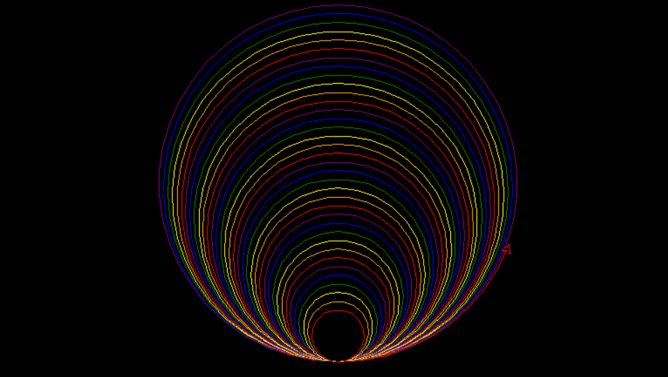
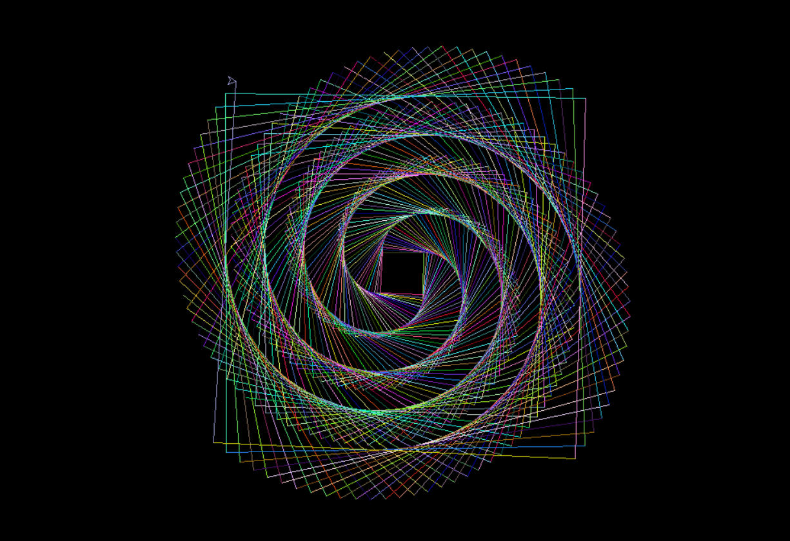

# Graphics-Using-Python
"Graphic using Python turtle" is a dynamic GitHub repository that provides an extensive collection of Python scripts for creating graphics using the Python turtle library. With easy-to-understand code examples, the repository enables users to generate visually stunning graphics and animations. The turtle library offers an intuitive interface, making it accessible for beginners to learn and experiment with computer graphics.

The repository covers a wide range of functionalities, allowing users to create simple and complex shapes, explore diverse color palettes, and experiment with different line styles and thicknesses. Each code example is well-documented, providing clear explanations and instructions for customization. This makes it an excellent resource for individuals looking to enhance their coding skills and understand fundamental programming concepts.

In summary, "Graphic using Python turtle" offers a valuable resource on GitHub for creating graphics and animations using the Python turtle library. With its accessible code examples, comprehensive documentation, and collaborative nature, the repository serves as a platform for both beginners and experienced users to dive into the world of computer graphics and unleash their creativity.

## Installation
### Install package with pip
```
pip install turtle
pip install colorsys
```

## Deployment Project Pattern01.py
### To deploy this project run
```
import turtle
from itertools import cycle
colors = cycle(['red', 'orange', 'yellow', 'green', 'blue', 'purple'])

def draw_circle(size):
    turtle.pencolor(next(colors))
    turtle.circle(size)
    draw_circle(size + 5)

turtle.bgcolor('black')
turtle.speed('fast')
turtle.pensize(1)
draw_circle(30)
```

### Output


## Deployment Project Pattern02.py
### To deploy this project run
```
from turtle import *
from random import randint

speed(0)
bgcolor("black")

x=1
while x<=400:
    r=randint(0,255)
    g=randint(0,255)
    b=randint(0,255)
    colormode(255)

    pencolor(r,g,b)

    fd(50+x)
    rt(90.911)
    x=x+1

exitonclick()
```

### Output



## Deployment Project Pattern03.py
### To deploy this project run
```
from turtle import *
colors=['red', 'purple', 'blue', 'green', 'yellow', 'orange']

speed(0)
bgcolor("black")

for x in range(360):
    pencolor(colors[x%6])
    width(x/100+1)
    forward(x)
    left(59)
```
### Output

## Deployment Project Pattern04.py
### To deploy this project run
```
import turtle
from itertools import cycle
colors = cycle(['red', 'orange', 'yellow', 'green', 'blue', 'purple'])

def draw_shape(size, angle, shift, shape):
    turtle.pencolor(next(colors))
    next_shape = ''
    if shape == 'circle':
        turtle.circle(size)
        next_shape = 'square'
    
    elif shape == 'square':
        for i in range(4):
            turtle.forward(size * 2)
            turtle.left(90)
        next_shape = 'circle'
    turtle.right(angle) 
    turtle.forward(shift) 
    draw_shape(size + 5, angle + 1, shift + 1, next_shape)

turtle.bgcolor('black')
turtle.speed('fast')
turtle.pensize(4)
draw_shape(15, 0, 1, 'circle')
```
### Output

## Deployment Project Pattern05.py
### To deploy this project run
```
import turtle as t
from random import randint, random

def draw_star(points, size, col, x, y):
    t.penup()
    t.goto(x, y)
    t.pendown()
    angle = 180 - (180 / points)
    t.color(col)
    t.begin_fill()
    
    for i in range(points):
        t.forward(size)
        t.right(angle)
    t.end_fill()

def draw_planet(col, x, y):
    t.penup()
    t.goto(x, y)
    t.pendown()
    t.color(col)
    t.begin_fill()
    t.circle(50)
    t.end_fill()

# Main code
t.Screen().bgcolor('black') 
while True:
    ranPts = randint(2, 5) * 2 + 1
    ranSize = randint(10, 50)
    ranCol = (random(), random(), random())
    ranX = randint(-350, 300)
    ranY = randint(-250, 250)
    draw_star(ranPts, ranSize, ranCol, ranX, ranY)
```
### Output

## Deployment Project Pattern06.py
### To deploy this project run
```
import turtle as t
from turtle import *
colors = ["blue", "green", "purple", "cyan", "magenta", "violet"]
t.bgcolor('black')
t.reset()
t.tracer(0, 0)
for i in range(45):
    t.color(colors[i % 6])
    t.pendown()
    t.fd(2 + i * 5)
    t.left(45)
    t.width(i)
    t.penup()
    
t.update()
exitonclick()
```
### Output

## Deployment Project Pattern07.py
### To deploy this project run
```
import turtle as t
from turtle import *

t.reset()
t.color("red")
t.speed(0)
for angle in range(0, 360, 15):
    t.seth(angle)
    t.circle(100)

exitonclick()
```
### Output

## Deployment Project Pattern08.py
### To deploy this project run
```
import turtle as t
from turtle import *

def drawfib(n, len_ang):
    t.forward(2 * len_ang)
    if n == 0 or n == 1:
        pass
    else:
        t.left(len_ang)
        drawfib(n - 1, len_ang)
        t.right(2 * len_ang)
        drawfib(n - 2, len_ang)
        t.left(len_ang)
    t.backward(2 * len_ang)

start_points = [[-300, 250], [-150, 250],[-300, 110], [-80, 110],[-300, -150], [50, -150]]

t.reset()
t.tracer(0, 0)
drawfib(30, 15)
t.update()
t.tracer(1, 15)
exitonclick()
```
### Output

## Deployment Project Pattern09.py
### To deploy this project run
```
import turtle as t
from turtle import *

t.reset()
t.tracer(0, 0)

def ks(length, d):
    if d == 0:
        t.forward(length)
    else:
        length = length / 3
        d = d - 1
        ks(length, d)
        t.right(60)
        ks(length, d)
        t.left(120)
        ks(length, d)
        t.right(60)
        ks(length, d)


colors = ["red", "orange", "pink"]
for i in range(3):
    t.color(colors[i])
    ks(200, 3)
    t.left(120)

t.update()
exitonclick()
```
### Output

## Deployment Project Pattern10.py
### To deploy this project run
```
import turtle
import random

window=turtle.Screen()
t=turtle.Turtle()
window.colormode(225)
t.speed(0)
t.width(1)
window.bgcolor("black")
t.pencolor("yellow")

def shape(angle, side, limit):
    reverseDirection=200
    t.forward(side)

    if side%(reverseDirection*2)==0:
        angle=angle+2
        print(side)

    elif side%(reverseDirection)==0:
        angle=angle-2
        print(side)
    
    t.right(angle)
    side=side+2

    if side<limit:
        shape(angle,side,limit)


shape(119, 0 ,600)
window.exitonclick()
```
### Output

## Deployment Project Pattern11.py
### To deploy this project run
```
from turtle import *
import colorsys

tracer(10)
bgcolor('black')
pensize(4)

h = 0

for i in range(411):
    c = colorsys.hsv_to_rgb(h, 1, 1)
    color(c)
    h += 1/37
    begin_fill()
    fillcolor('black')
    left(120)
    forward(i)
    left(3)
    circle(i,12)
    end_fill()

done()
```
### Output

## Deployment Project Pattern12.py
### To deploy this project run
```
import turtle as t

t.bgcolor("black")
t.speed(0)
t.hideturtle()

colors = ["yellow", "red", "yellow", "red"]

for i in range(120):
    for c in colors:
        t.color(c)
        t.circle(200-i,100)
        t.lt(90)
        t.circle(200-i,100)
        t.rt(60)
        t.end_fill()
t.mainloop()
```
### Output

## Deployment Project Pattern13.py
### To deploy this project run
```
from turtle import *

bgcolor("black")
speed(0)
hideturtle()

for i in range(200):
    color("red")
    circle(i)
    color("orange")
    circle(i*0.8)
    right(3)
    forward(3)
done()
```
### Output


If you have any confusion, please feel free to contact me. Thank you
